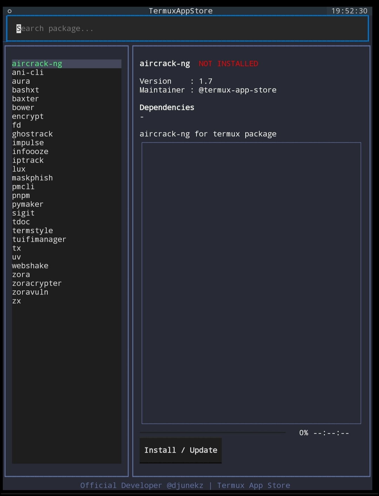
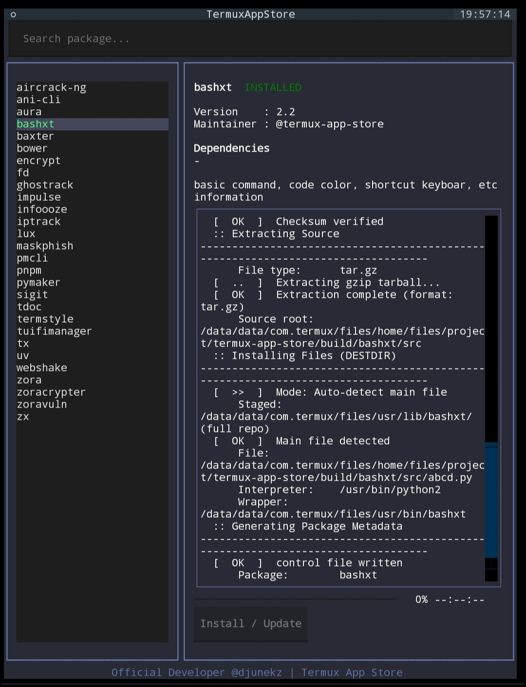
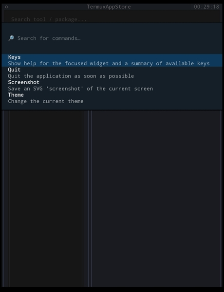

<div align="center">


<br/>

# Termux App Store

**The first offline-first, source-based TUI package manager built natively for Termux.**

[](https://github.com/djunekz/termux-app-store/actions)
[](https://codecov.io/github/djunekz/termux-app-store)<br>

[](https://github.com/djunekz/termux-app-store)
[](LICENSE)
<br>
<br>
[](https://github.com/djunekz/termux-app-store/stargazers)
[](https://github.com/djunekz/termux-app-store/network)
<br>
<br>
[](https://github.com/djunekz/termux-app-store/issues)
[](https://github.com/djunekz/termux-app-store/pulls)
[](https://github.com/djunekz/termux-app-store)

> **Offline-first &nbsp;•&nbsp; Source-based &nbsp;•&nbsp; Binary-safe &nbsp;•&nbsp; Termux-native**

</div>

---

## What is Termux App Store?

**Termux App Store** is a **TUI (Terminal User Interface)** built with Python ([Textual](https://github.com/Textualize/textual)) and CLI that lets Termux users **browse, build, and manage tools/apps** directly on Android — no account, no telemetry, no cloud dependency.

> [!IMPORTANT]
> Termux App Store is **not a centralized binary repository** and **not a hidden auto-installer**.
> All builds run **locally, transparently, and under full user control**.

---

## Who Is It For?

| User | Use Case |
|---|---|
| Termux Users | Full control over builds & packages |
| Developers | Distribute tools via source-based packaging |
| Reviewers & Auditors | Review and validate build scripts |
| Maintainers | Manage multiple Termux packages at once |

---

## Screenshots

<div align="center">


<br/><br/>

| Main Interface | Install Interface | Menu Palette |
|:---:|:---:|:---:|
|  |  |  |
| TUI main menu | Package install process | Command palette |

> User-friendly with full **touchscreen** support

</div>

---

## Quick Install

### Option 1 (Recommended)
```bash
pkg install python
pip install termux-app-store
```

### Option 2 (Manual)
```bash
git clone https://github.com/djunekz/termux-app-store
cd termux-app-store
bash install.sh
```

or

```bash
git clone https://github.com/djunekz/termux-app-store
cd termux-app-store
./tasctl install
```

Then run:

```bash
termux-app-store        # Open interactive TUI
termux-app-store -h     # Show CLI help
```

---

## Uninstall
```bash
pip uninstall termux-app-store
```

or

```bash
./tasctl uninstall
```

---

## Usage

### TUI — Interactive Interface
```bash
termux-app-store
```

### CLI — Direct Commands

```bash
termux-app-store list                  # List all packages
termux-app-store show <package>        # Show package details
termux-app-store install <package>     # Build & install a package
termux-app-store update                # Check for available updates
termux-app-store upgrade               # Upgrade all packages
termux-app-store upgrade <package>     # Upgrade a specific package
termux-app-store version               # Check latest version
termux-app-store help                  # Full help
```

---

## Features

<table>
<tr>
<td width="50%">

**Package Browser (TUI)**
Browse packages from the `packages/` folder interactively with keyboard & touchscreen navigation.

**Smart Build Validator**
Detects unsupported Termux dependencies with automatic status badges.

**Real-time Search & Filter**
Instantly search packages by name or description — no reload needed.

**One-Click Build**
Install or update a package in one click via `build-package.sh`.

</td>
<td width="50%">

**One-Click Validator**
Validate packages before distribution via `./termux-build`.

**One-Click Manage**
Install / update / uninstall Termux App Store itself via `./tasctl`.

**Self-Healing Path Resolver**
Auto-detects app location even if the folder is moved or renamed.

**Privacy-First**
No account, no tracking, no telemetry — fully offline.

</td>
</tr>
</table>

---

## Package Status Badges

| Badge | Description |
|---|---|
| **NEW** | Newly added package (< 7 days) |
| **UPDATE** | A newer version is available |
| **INSTALLED** | Installed version is up-to-date |
| **UNSUPPORTED** | Dependency not available in Termux |

---

## Adding a Package

Every package **must** have a `build.sh` file:

```
packages/<tool-name>/build.sh
```

### Minimal `build.sh` Template

```bash
TERMUX_PKG_HOMEPAGE=""
TERMUX_PKG_DESCRIPTION=""
TERMUX_PKG_LICENSE=""
TERMUX_PKG_MAINTAINER="@your-github-username"
TERMUX_PKG_VERSION=""
TERMUX_PKG_SRCURL=""
TERMUX_PKG_SHA256=""
```

> [!NOTE]
> See the full template in `template/build.sh`
> or run: `./termux-build template`

---

## termux-build — Validation Tool

**termux-build** is a validation and reviewer helper tool — not an auto-upload or auto-publish tool.

```bash
./termux-build lint <package>        # Lint a build script
./termux-build check-pr <package>    # Check PR readiness
./termux-build doctor                # Diagnose environment
./termux-build suggest <package>     # Get improvement suggestions
./termux-build explain <package>     # Detailed package explanation
./termux-build template              # Generate build.sh template
./termux-build guide                 # Contribution guide
```

> [!NOTE]
> termux-build **only reads and validates** — it does not modify files, auto-build, or upload to GitHub.

---

## Architecture

```
termux-app-store/
├── packages/              # All packages directory
│   └── <tool-name>/
│       └── build.sh       # Metadata & build script
├── template/
│   └── build.sh           # Package template
├── tasctl                 # TAS installer/updater/uninstaller
├── termux-build           # Validation & review tool
└── install.sh             # Main installer
```

> Full details: [ARCHITECTURE](ARCHITECTURE.md)

---

## Security & Privacy

<table>
<tr>
<td width="50%">

**Security**
- No extra permissions required
- No network ports opened
- No background services running
- Builds only run on explicit user command

</td>
<td width="50%">

**Privacy**
- No account or registration
- No analytics or tracking
- No telemetry of any kind
- Offline-first by design

</td>
</tr>
</table>

> Full details: [SECURITY](SECURITY.md) &nbsp;|&nbsp; [PRIVACY](PRIVACY.md) &nbsp;|&nbsp; [DISCLAIMER](DISCLAIMER.md)

---

## Upload Your Tool to Termux App Store

Want to share your tool with the Termux community?

**Benefits of uploading:**
- Your tool becomes available to all Termux users
- Updates only require changing `version` and `sha256` in `build.sh`
- Your tool appears in the TUI with automatic status badges

**How to upload:**

```bash
# 1. Fork this repo
# 2. Add your package folder:
mkdir packages/your-tool-name
# 3. Create build.sh from the template
# 4. Validate with termux-build:
./termux-build lint packages/your-tool-name
# 5. Submit a Pull Request
```

> Full guide: [How to upload package in termux-app-store](HOW_TO_UPLOAD.md)

---

## Contributing

All contributions are welcome!

| How to Contribute | Description |
|---|---|
| Add a package | Submit a new tool package |
| Report a bug | Open an issue on GitHub |
| Send a PR | Code or documentation improvements |
| Review PRs | Help validate others' contributions |
| Security audit | Review build script security |
| Improve docs | Clarify or translate documentation |

> Full guide: [CONTRIBUTING](CONTRIBUTING.md)

---

## ❓ Help & Documentation

| Document | Description |
|---|---|
| [FAQ](FAQ.md) | Frequently asked questions |
| [TROUBLESHOOTING](TROUBLESHOOTING.md) | Solutions to common problems |
| [HOW TO UPLOAD](HOW_TO_UPLOAD.md) | How to upload your tool |
| [CONTRIBUTING](CONTRIBUTING.md) | Contribution guide |
| [SUPPORT](SUPPORT.md) | How to get support |

---

## Philosophy

> *"Local first. Control over convenience. Transparency over magic."*

Termux App Store is built for users who want to:
- Fully understand what runs on their device
- Control builds and sources directly
- Avoid vendor lock-in and cloud dependency
- Share tools openly with the Termux community

---

## License

This project is licensed under the **MIT License** — see [LICENSE](LICENSE) for details.

---

## Maintainer

<div align="center">

**Djunekz** — Independent & Official Developer

[](https://github.com/djunekz)

</div>

---

## Support This Project

If Termux App Store has been useful to you:

- **Star** this repo — helps others discover it
- **Share** it in Termux & Android communities
- **Report bugs** via Issues
- **Submit a PR** for any improvement

---

## Star History

[](https://www.star-history.com/?repos=djunekz%2Ftermux-app-store&type=date&legend=top-left)

---

<div align="center">

**© Termux App Store — Built for everyone, by the community.**

*termux · termux app store · termux package manager · termux tui · android terminal tools · termux tools · termux packages · termux cli*

</div>
